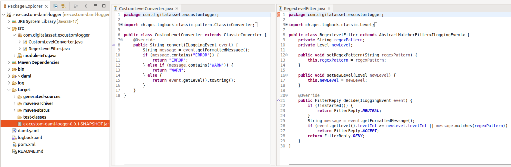
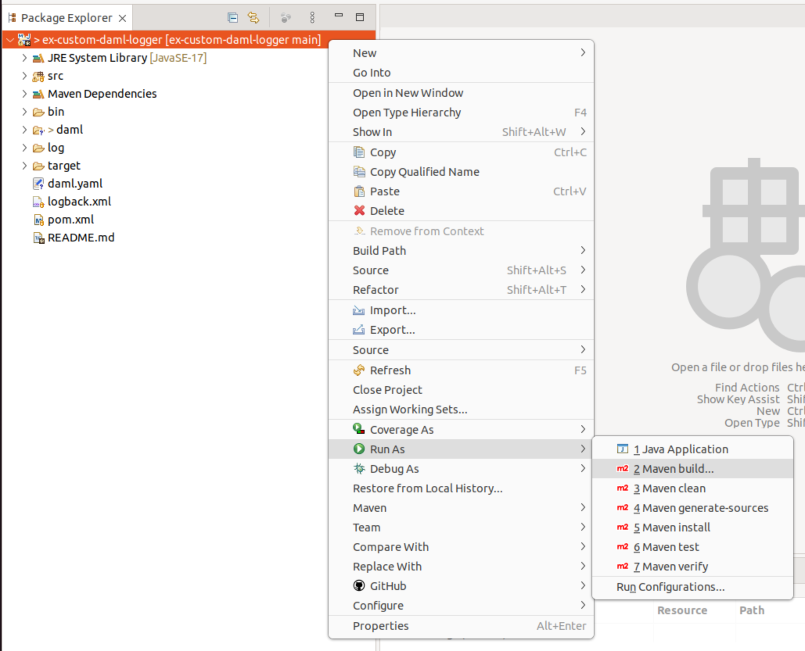
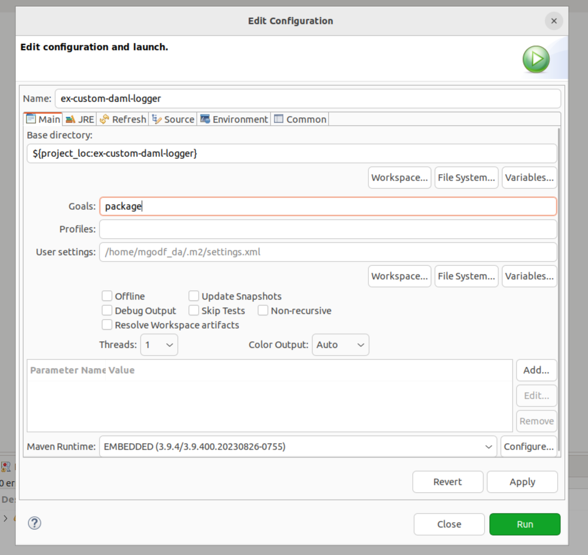
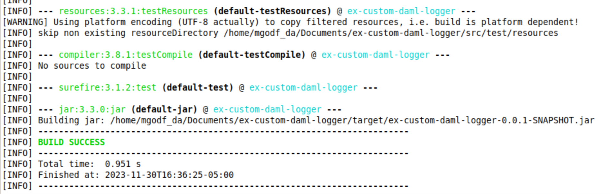

# Building A Custom Daml Logger in Eclipse

This project consists of two source files which you can modify to suit your needs:
- `src/com/digitalasset/excustomlogger/CustomLevelConverter.java`
- `src/com/digitalasset/excustomlogger/RegexLevelFilter.java`

### Step 1 - Generate Build

In the Package Explorer right click on the project and select `Run As` -> `Maven Build...`

### Step 2 - Generate Package

In the Edit Configuration dialog, enter `package` in the Goals field and click `Run`

### Step 3 - Copy (.jar) File

Copy the (.jar) file from the location printed to console